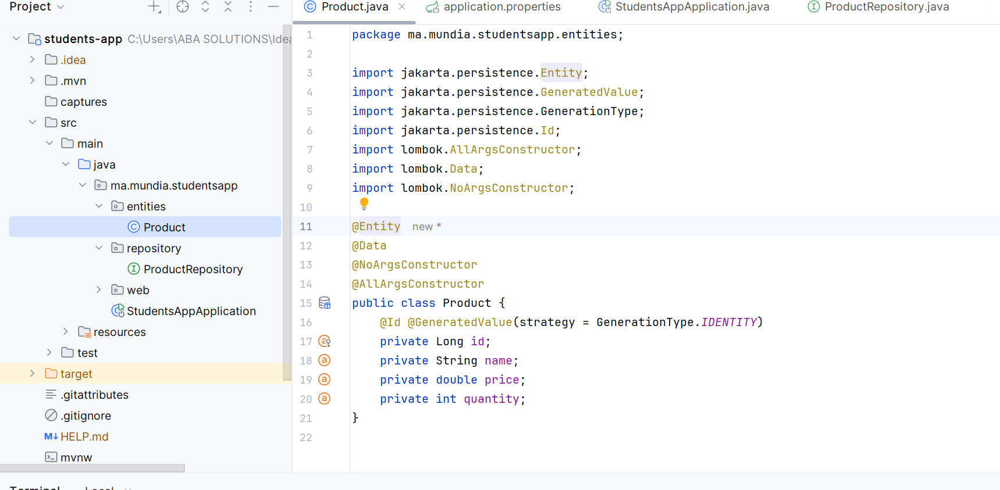
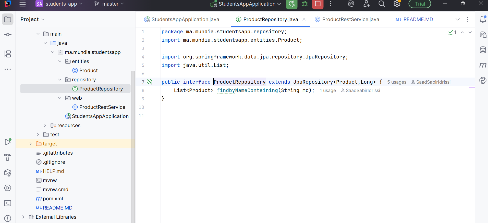
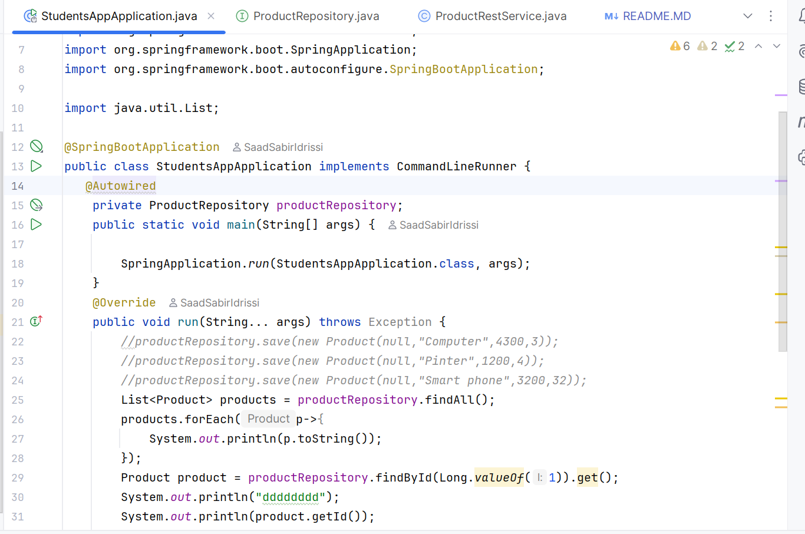

<h3> COMPTE RENDU </h3>

 Dans le package entities, création de la classe Product.java
 

<h2>  Création du repository JPA </h2>

 Dans le package entities, création de la classe Product.java
 

<h2>  Classe principale avec des tests CRUD</h2>

